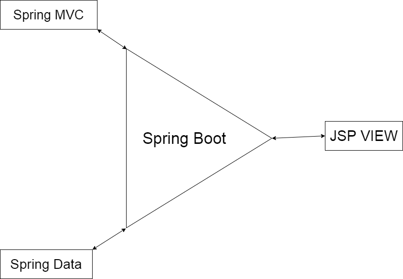

# Проект "Форум Spring Boot"

Запустить: [https://intense-retreat-50224.herokuapp.com/](https://intense-retreat-50224.herokuapp.com/)

* [Технологии](#технологии)
* [Описание](#описание)
* [Функционал](#функционал)
* [Архитектура](#архитектура)
* [Тесты](#тесты)
* [Автор](#автор)
* [Критика и предложения](#критика_и_предложения)

## Технологии
* Spring(Boot, Security, Data, MVC)
* PostgreSQL
* Apache Tomcat
* JSP/JSTL
* Junit tests(Spring Test)

## Описание
Spring-Boot приложение "Форум".
Хранение данных в Spring Data.
В качестве базы данных используется PostgreSQL.
Front-end на JSP.

## Функционал
* Регистрация и авторизация через Spring Security + JDBC + PostgreSql
* Создание/добавление/редактирование/удаление тем
* Создание/добавление/редактирование/удаление сообщений в темах

## Архитектура

Проект разделён на слои:
1. Конфигурация Spring Boot
    
    1.1 [Main](src/main/java/ru/job4j/forum/Main.java) - Главный класс с 
    аннотацией @SpringBootApplication, через который запускается приложение.
    1.2 [WebSecurity](src/main/java/ru/job4j/forum/config/WebSecurity.java) - 
    настройки авторизации/регистрации через Spring Security.
2. Модели(Entity):
    2.1 [Authority](src/main/java/ru/job4j/forum/model/Authority.java) - роль пользователя(админ, пользователь, гость, ...)
    2.2 [User](src/main/java/ru/job4j/forum/model/User.java) - пользователь
    2.3 [Post](src/main/java/ru/job4j/forum/model/Post.java) - тема форума
    2.4 [SubPost](src/main/java/ru/job4j/forum/model/SubPost.java) - сообщение в теме
3. Хранилище(Repository) Spring Data
    3.1 [AuthorityRepository](src/main/java/ru/job4j/forum/repository/AuthorityRepository.java)    
    3.2 [UserRepository](src/main/java/ru/job4j/forum/repository/UserRepository.java)    
    3.3 [PostRepository](src/main/java/ru/job4j/forum/repository/PostRepository.java)    
    3.4 [SubPostRepository](src/main/java/ru/job4j/forum/repository/SubPostRepository.java)    
4. Сервис-слой
    4.1 [PostService](src/main/java/ru/job4j/forum/service/PostService.java)    
    4.2[SubPostService](src/main/java/ru/job4j/forum/service/SubPostService.java)    
5. Контроллеры
    5.1 [IndexControl](src/main/java/ru/job4j/forum/control/IndexControl.java) - контроллер для загрузки тем на главную страницу. 
    5.2 [LoginControl](src/main/java/ru/job4j/forum/control/LoginControl.java) - контроллер для страницы входа в систему    
    5.3 [RegControl](src/main/java/ru/job4j/forum/control/RegControl.java) - контроллер для страницы регистрации  
    5.4 [PostControl](src/main/java/ru/job4j/forum/control/PostControl.java) - контроллер для создания/редактирования/удаления тем
    5.5 [SubPostControl](src/main/java/ru/job4j/forum/control/SubPostControl.java) - контроллер для создания/редактирования/удаления сообщений в темах.  
6. View(JSP)
    6.1 [login.jsp](src/main/webapp/WEB-INF/views/login.jsp) - Страница авторизации
    6.2 [reg.jsp](src/main/webapp/WEB-INF/views/reg.jsp) - Страница регистрации
    6.3 [index.jsp](src/main/webapp/WEB-INF/views/index.jsp) - Главная страница, куда выводятся все темы.
    6.4 [post.jsp](src/main/webapp/WEB-INF/views/post.jsp) - Страница для вывода конкретной темы.
    6.5 [edit.jsp](src/main/webapp/WEB-INF/views/edit.jsp) - Страница для редактирования/создания темы
    6.5 [subpost/edit.jsp](src/main/webapp/WEB-INF/views/subpost/edit.jsp) - Страница для редактирования сообщения в теме

## Тесты
Тесты на контроллеры(Junit, Spring Test)
1. [IndexControlTest](src/test/java/ru/job4j/forum/control/IndexControlTest.java)
2. [LoginControlTest](src/test/java/ru/job4j/forum/control/LoginControlTest.java)
3. [RegControlTest](src/test/java/ru/job4j/forum/control/RegControlTest.java)
4. [PostControlTest](src/test/java/ru/job4j/forum/control/PostControlTest.java)
5. [SubPostControlTest](src/test/java/ru/job4j/forum/control/SubPostControlTest.java)

## Автор

Гераськин Егор Владимирович

Java-разработчик

yegeraskin13@gmail.com

+79271506651

## Критика_и_предложения
Все замечания и пожелания по этому проекту просьба направлять мне 
на электронный адрес: yegeraskin13@gmail.com